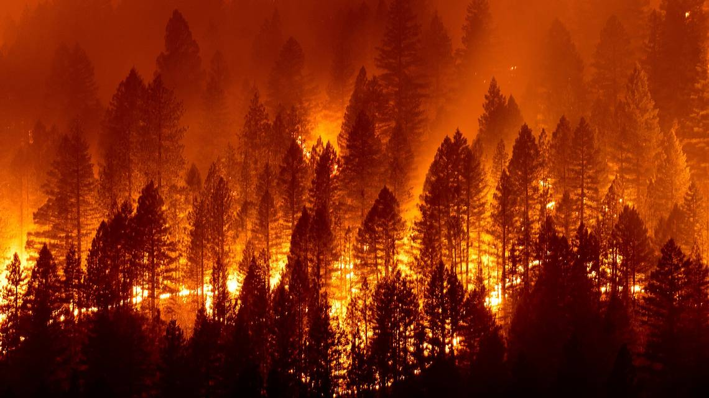

# California Wildfires Analysis

## Topic
The focus of this project will be on California wildfires.

## Why Wildfires?
This topic was chosen due to gauge what we may experience in the next upcoming fire season. As the summer comes to a close, it's important to analyze the past fire data and current precipitation values to get a gauge on what we may experience in the next upcoming fire season.

## High-Level Overview
Our goal is to first determine the most susceptible wildfire areas by looking at the largest fires in recent years. From this data, we can see that there are some areas that are more susceptible to fire danger. In these areas, it's important to share fire awareness. Also it helps to clear out dead leaves and brush and making sure campfires are put out properly are simple ideas of prevention. Unfortunately there are always some unexpected incidents that may arise, for example, the lighting of fireworks and random lightning strikes. However, in looking at the data, we can utilize a model to help predict if/when our next fires may occur. This way firefighters can take a more proactive approach in combating issues that may occur.

## Description of Source Data
Some of the variables that can cause fires include weather patterns, fuel/environmental factors, drought/water levels, the number of fire stations/resources available at the time of an incident, and preventative measures.

## Questions We Hope to Answer
- When and where could the next California wildfire be?
- How does temperature play a role in fire season?
- Are there specific counties that are more prone to wildfires?

## Datasets
[Kaggle Wildfire Data (2013-2020)](https://www.kaggle.com/ananthu017/california-wildfire-incidents-20132020) 
The above link has a dataset that contains geographical information such as latitude and longitude, county, acres burned, [fire] engines, start and extinguished dates.

[Rainfall and Temperature Data (1981-2021)](https://prism.oregonstate.edu/recent/) 
This website has a dataset that includes information on monthly precipiration as well as mean/min/max temperature data

[Precipitation and Temperature Data (1901-2021)](https://www.ncdc.noaa.gov/cag/county/mapping/4/pcp/201902/1/value) 
The hyperlink above also includes a dataset on monthly precipiration as well as mean/min/max temperature data

### Team Member Roles
There were four roles to be assumed by the members of our group, which was comprised of 5 members -- Jinfang Li, Wendy Mudzinski, Stephen Tan, Rachel Tsuchiyama, and Cassie Xu. The roles and descriptions for Week 1 are below:
- **Square** - *responsible for the GitHub repository*
    - Stephen
- **Triangle** - *creates mockup of a machine learning model*
    - Rachel, Cassie
- **Circle** - *creates mockup of a database with a set of sample data*
    - Jinfang, Wendy
- **X** - *decides which technologies to use for each step of the project* 
    - No one assumed this role since we all contributed equally

----------

## Database
A provisional database was created that includes samples data that mimics the expected final database schema and is tied to our draft machine learning model.

## Machine Learning Model
The provisional machine learning model that we created is a draft for the final machine learning model that. This provisional model (1) takes in data from the provisional database shown above and (2) outputs labels for the input data sourced from our datasets.

As depicted in Figure 1 below, you can see that xxxx

(Figure 1)

From the model in Figure 2, we've applied xxx algorithm to train the data.  From that you can see that the accuracy score is xxx% with the precision at xxx% and the recall at xx%.

(Figure 2)
